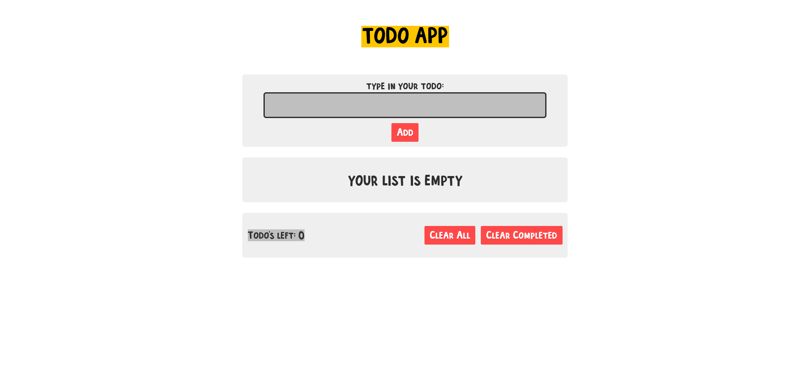

# Todo app React Redux Toolkit

## Table of contents

- [Overview](#overview)
  - [Description](#description)
  - [Screenshot](#screenshot)
  - [Links](#links)
- [My process](#my-process)
  - [Built with](#built-with)
  - [What I learned](#what-i-learned)
  - [Continued development](#continued-development)
  - [Useful resources](#useful-resources)
- [Author](#author)

## Overview

### Description

This is a Todo App designed and developed by myself in order to practice React with new Redux Toolkit. The app also takes adventage of Redux Persist to save global state in user's local storage.

### Screenshot

### Links

- Live Site URL: [Add live site URL here](https://your-live-site-url.com)

## My process

### Built with

- Html5
- CSS custom properties
- Flexbox
- [React](https://reactjs.org/) - JS library
- [Redux Toolkit](https://redux-toolkit.js.org/) - State management library
- [Redux Persist](https://www.npmjs.com/package/redux-persist) - For saving state in local storage
- [Styled Components](https://styled-components.com/) - For styles

### What I learned

Things I learned:

- How to properly structure React/Redux project files.
- How to set up Redux Toolkit inside React application.
- How to create Redux Toolkit "Slices" and create reducers and actions.
- Polished my skills with Styled Components library
- How to use React-Redux "useDispatch" and "useSelector" hooks.

### Continued development

In future projects with React/Redux I would like to focus on:

- Connecting Redux to the backend/API, using Redux Thunk
- Work on more complex application
- Implement User authentication and authorization

### Useful resources

- [Redux Toolkit Docs](https://redux-toolkit.js.org/) - Everyone appreciates well writen doc's and redux toolkit doc's are definitly one of them. I really liked this pattern os setting up global state and will use it going forward.
- [StackOverflow](https://stackoverflow.com/questions/63761763/how-to-configure-redux-persist-with-redux-toolkit) - This StackOverflow Post helped me to set up redux persist with Redux Toolkit.

## Author

- Website - [Add your name here](https://www.your-site.com)
- LinkedIn - [@yourusername](https://www.linkedin.com/in/tomasz-posiada%C5%82a-3a05391b0/)
